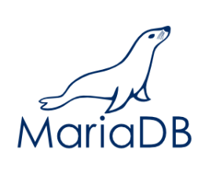
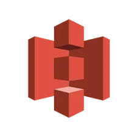
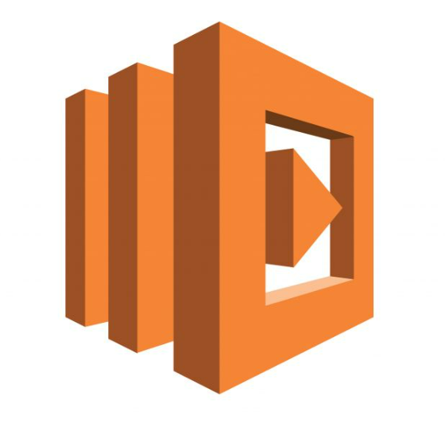
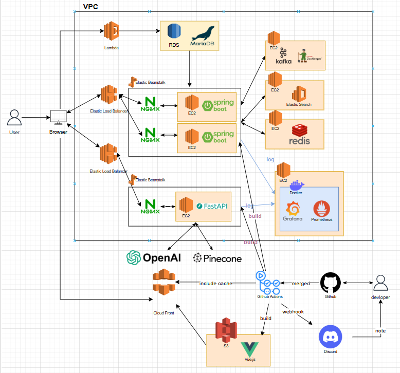

<h1 align="center">채용 전환형 인턴을 위한 온보딩 시스템</h1>
<h2 align="center">Onboarding System for Intern-to-Full-Time Transition</h2>
<h3 align="center">⭐3조 hihello⭐</h3>

| |  |  |  |   |
|:-----------------------------------------------------------------------------------------:|:------------------------------------------------------------------------------------------:|:------------------------------------------------------------------------------------------:|:-------------------------------------------------------------------------------------------:|:--------------------------------------------------------------------------------------------:|
|                      구대윤 [@kookong2](https://github.com/kookong2)                      |                              권형미 [@hyomee2](https://github.com/hyomee2)               |                     김민주 [@minju0224](https://github.com/minju0224)                      |                       김윤후 [@WhooGeek](https://github.com/WhooGeek)                       |                     김태영 [@wildcat222](https://github.com/wildcat222)                      |

  
🎯 프로젝트 개요

  

    

     

>[프로젝트 기획서](https://docs.google.com/document/d/10-rBIVVxRV5bcQZF-zKqIN9KAENM4mPXSNmPdMm0b8U/edit?tab=t.0)
    

  

  
🎯 기술 스택

  

    <h4 align="center">프로젝트</h4>
    <table align="center">
      <tr>
        <td> Git</td>
        <td> GitHub</td>
        <td> Figma</td>
        <td style="text-align: center;">
          
           IntelliJ IDEA
        </td>
        <td> vscode</td>
      </tr>
    </table>
    <h4 align="center">프론트엔드</h4>
    <table align="center">
      <tr>
        <td> HTML</td>
        <td> CSS</td>
        <td> JavaScript</td>
        <td> Vue.js</td>
      </tr>
    </table>
    <h4 align="center">백엔드</h4>
    <table align="center">
      <tr>
        <td> Java</td>
        <td> Spring</td>
        <td> Gradle</td>
        <td> Kafka</td>
        <td> Python</td>
        <td> FastAPI</td>
        <td> ElasticSearch</td>
        <td> MariaDB</td>
        <td> MongoDB</td>
      </tr>
    </table>
    <h4 align="center">클라우드</h4>
    <table align="center">
      <tr>
        <td> CloudWatch</td>
        <td> RDS</td>
        <td> S3</td>
        <td> EC2</td>
        <td> Lambda</td>
      </tr>
    </table>
    <h4 align="center">인프라</h4>
    <table align="center">
      <tr>
        <td> GitHub Actions</td>
        <td> Nginx</td>
        <td> ElasticBeanstalk</td>
      </tr>
    </table>
  

  
🎯 ERD

  

   

  >[ERD](https://www.erdcloud.com/d/yCNxCAcuq7CCDuz8a)

  

  
🎯 WBS

  

   

>[WBS](https://docs.google.com/spreadsheets/d/1F-cg6s2nEanYSHGntDhI2j4zHp84mA0LCy3uGkZ1FhE/edit?usp=sharing)

  

  
🎯 화면정의서

  

   

>[화면정의서](https://docs.google.com/spreadsheets/d/1F-cg6s2nEanYSHGntDhI2j4zHp84mA0LCy3uGkZ1FhE/edit?gid=1147583410#gid=1147583410)
 [피그마](https://www.figma.com/design/oDt94i9yE3AkHu9L3Sd6z5/hi%2Chello?node-id=0-1&t=uVJ0OAz048SFHcRJ-1)
  

  
🎯 시스템 아키텍처 설계서

  

   

  

  
🎯 프로그램 사양서

  

    <ul>
      <li>1</li>
      <li>2</li>
    </ul>
  

  
🎯 주요 단위 테스트 결과서

  

    <ul>
      <li>1</li>
      <li>2</li>
    </ul>
  

  
🎯 UI/UX 단위 테스트결과서

  

    <ul>
      <li>1</li>
      <li>2</li>
    </ul>
  

  
🎯 CI/CD 계획서

  

    <ul>
      <li>1</li>
      <li>2</li>
    </ul>
  

<h3>🎯 통합 배포 결과서</h3>

<h4>🏹 프론트엔드 배포</h4>

<h4>🏹 백엔드 배포</h4>
