<h1 align="center">채용 전환형 인턴을 위한 온보딩 시스템</h1>
<h2 align="center">Onboarding System for Intern-to-Full-Time Transition</h2>
<h3 align="center">⭐3조 hihello⭐</h3>

|  |  |  |  |  |
|:-------------------------------------------------------------------------------------------:|:------------------------------------------------------------------------------------------:|:------------------------------------------------------------------------------------------:|:-------------------------------------------------------------------------------------------:|:--------------------------------------------------------------------------------------:|
|             구대윤 [@kookong2](https://github.com/kookong2)                               |                              권형미 [@hyomee2](https://github.com/hyomee2)               |                     김민주 [@minju0224](https://github.com/minju0224)                      |                       김윤후 [@WhooGeek](https://github.com/WhooGeek)                       |                          김태영 [@wildcat222](https://github.com/wildcat222)                     |

  
🎯 프로젝트 개요

  

    

     

>[프로젝트 기획서](https://docs.google.com/document/d/10-rBIVVxRV5bcQZF-zKqIN9KAENM4mPXSNmPdMm0b8U/edit?tab=t.0)
    

  

  
🎯 기술 스택

  

    <h4 align="center">프로젝트</h4>
    

        

            
            
Git

        

        

            
            
GitHub

        

        

            
            
Figma

        

        

            
            
IntelliJ IDEA

        

        

            
            
vscode

        

    

    <h4 align="center">프론트엔드</h4>
    

        

            
            
HTML

        

        

            
            
CSS

        

        

            
            
JavaScript

        

        

            
            
Vue.js

        

    

    <h4 align="center">백엔드</h4>
    

        

            
            
Java

        

        

            
            
Spring

        

        

            
            
Gradle

        

        

            
            
Kafka

        

        

            
            
Python

        

        

            
            
FastAPI

        

        

            
            
ElasticSearch

        

        

            
            
MariaDB

        

        

            
            
MongoDB

        

    

    <h4 align="center">클라우드</h4>
    

        

            
            
CloudWatch

        

        

            
            
RDS

        

        

            
            
S3

        

        

            
            
EC2

        

        

            
            
Lambda

        

    

    <h4 align="center">인프라</h4>
    

        

            
            
GitHub Actions

        

        

            
            
Nginx

        

        

            
            
ElasticBeanstalk

        

    

  

  
🎯 요구사항 명세서

  

   

  >[요구사항 명세서 링크](https://docs.google.com/spreadsheets/d/1F-cg6s2nEanYSHGntDhI2j4zHp84mA0LCy3uGkZ1FhE/edit?usp=sharing)

  

  
🎯 ERD

  

   

  >[ERD](https://www.erdcloud.com/d/yCNxCAcuq7CCDuz8a)

  

  
🎯 WBS

  

   

>[WBS](https://docs.google.com/spreadsheets/d/1F-cg6s2nEanYSHGntDhI2j4zHp84mA0LCy3uGkZ1FhE/edit?usp=sharing)

  

  
🎯 화면정의서

  

   

>[화면정의서](https://docs.google.com/spreadsheets/d/1F-cg6s2nEanYSHGntDhI2j4zHp84mA0LCy3uGkZ1FhE/edit?gid=1147583410#gid=1147583410)

  

  
🎯 시스템 아키텍처 설계서

  

    <ul>
      <li>1</li>
      <li>2</li>
    </ul>
  

  
🎯 프로그램 사양서

  

    <ul>
      <li>1</li>
      <li>2</li>
    </ul>
  

  
🎯 UI/UX 단위 테스트결과서

  

    <ul>

  

  
담당자 - 회원 

  로그인

  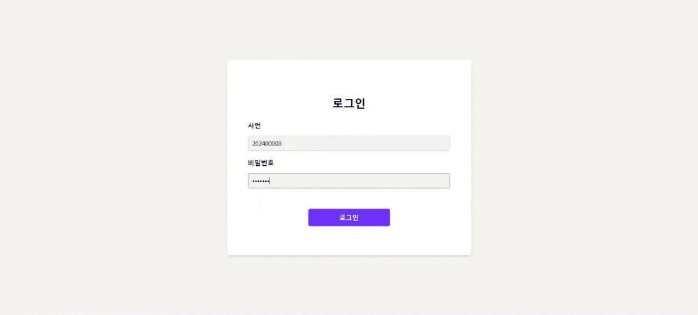

  사원 추가
  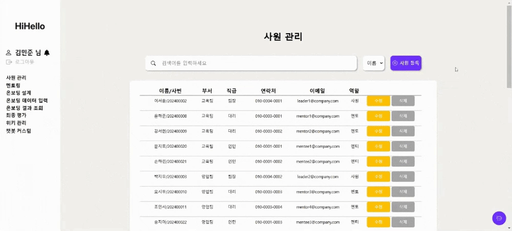

  사원 수정
  

  사원 삭제
  

  비밀번호 변경
  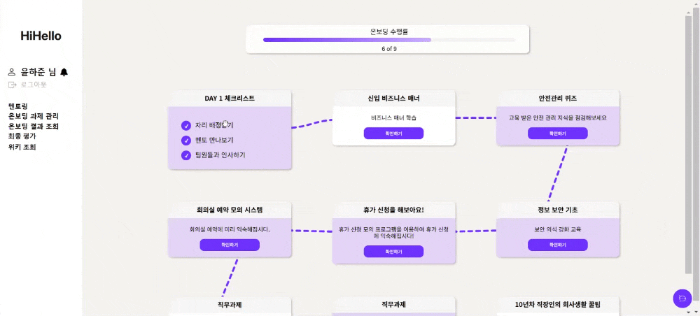

  

  

  
담당자 - 멘토/멘티

  멘토 멘티 매칭
  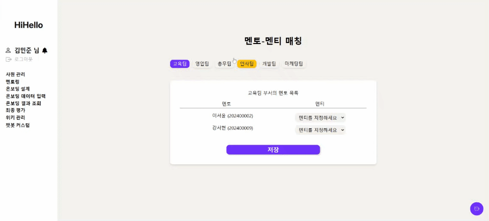

  

  

  
담당자 - 퀴즈

  퀴즈 등록
  

  퀴즈 수정
  

  

  

  
담당자 - 평가지표

  공통 평가 지표 조회 + 등록
  

  공통 평가 지표 삭제
  
  

  

  
담당자 - 동료 평가 지표

  동료 평가 지표 조회 + 추가
  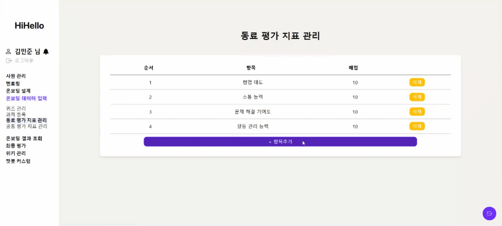

  동료 평가 지표 삭제
  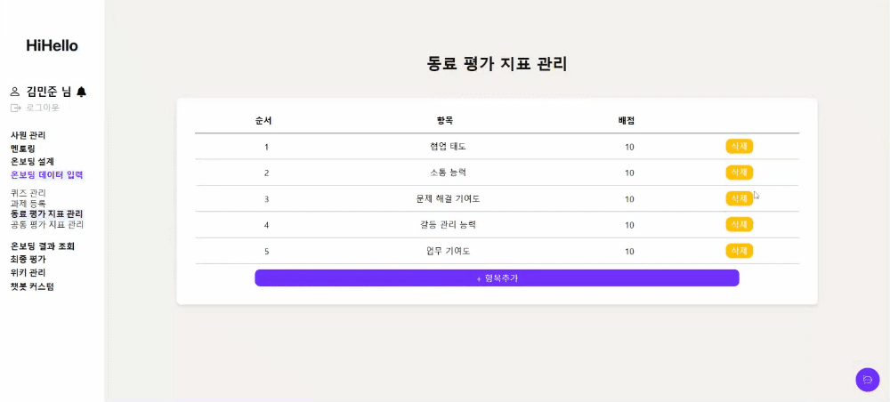

  

  

  
담당자 - 평가 조회

  평가된 과제 조회
  

  최종 평가 조회회
  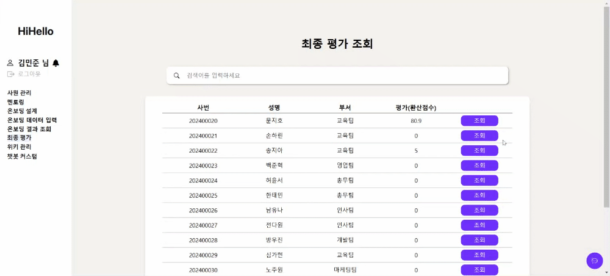
  
  

  

  
담당자 - 온보딩

  온보딩 등록
  

  온보딩 순서 편집
  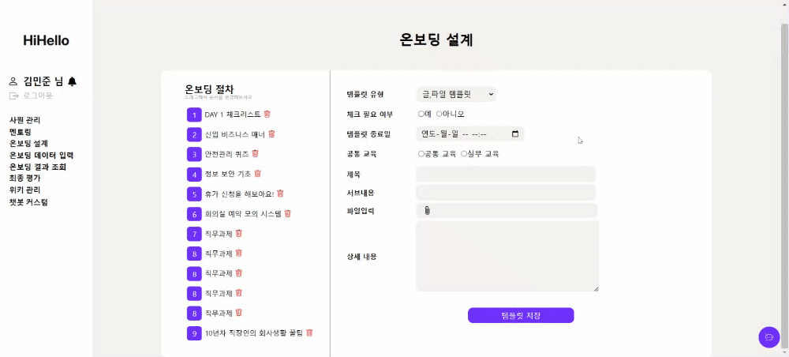

  멘티 그룹 생성
  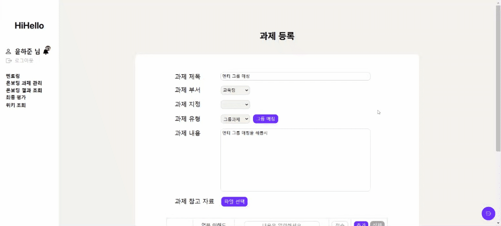

  

  

  
담당자 - 멘토링 계획서

  멘토링 계획서 등록
  

  멘토링 계획서 조회
  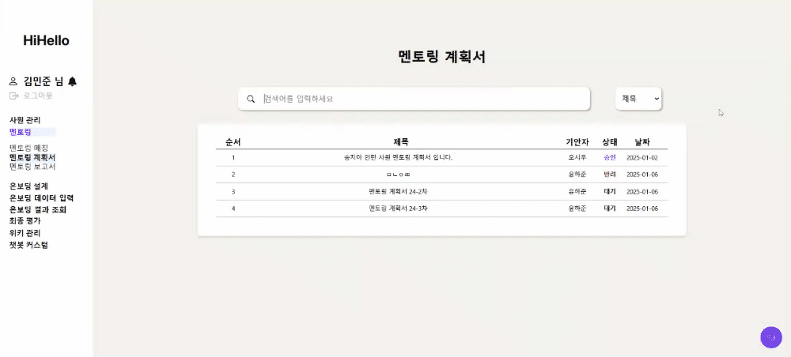

  멘토링 계획서 상세조회
  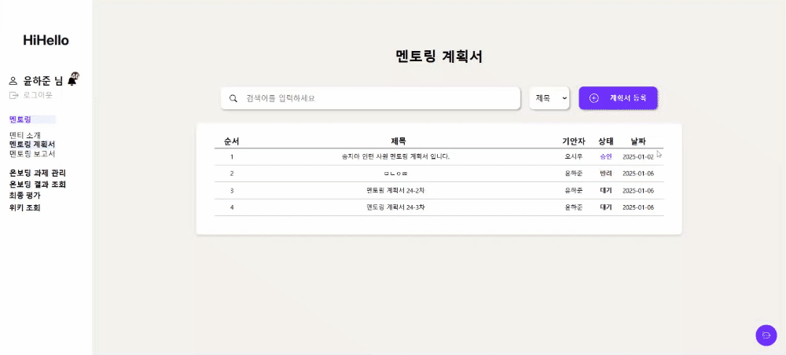

  

  

  
담당자 - 위키

  위키 삭제
  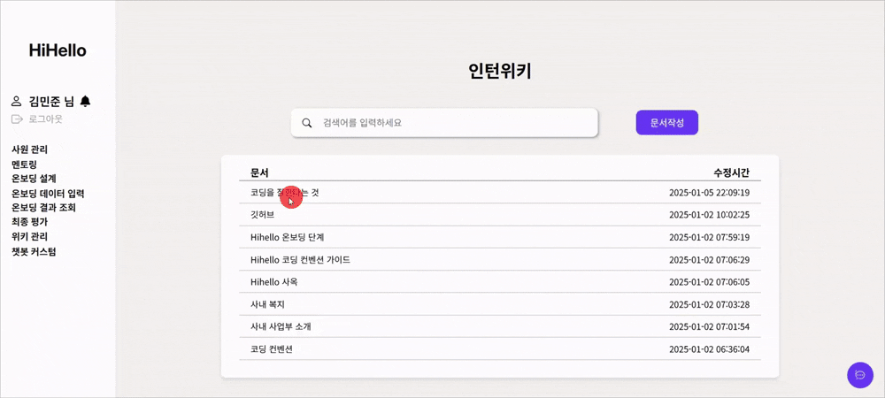

  

  

  
멘토 - 온보딩

  멘토 온보딩 조회
  

  

  

  
멘토 - 과제

  멘토 그룹 과제 생성
  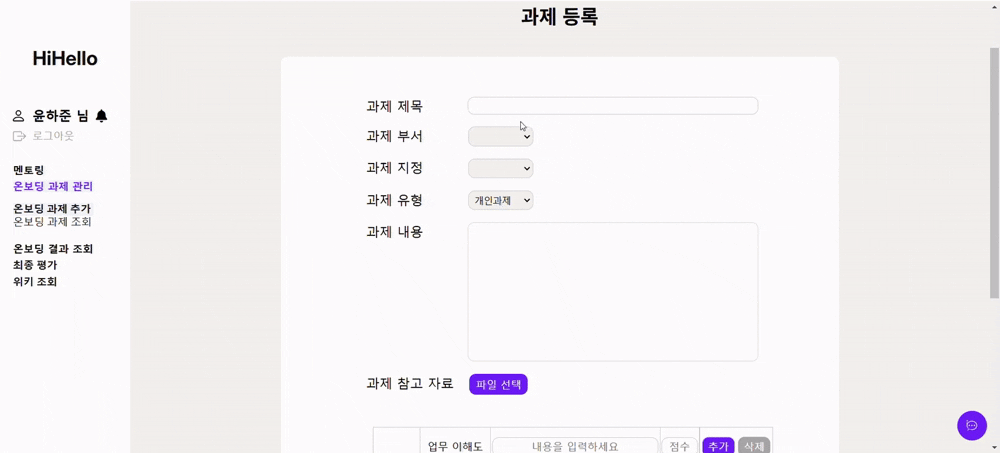

  

  

  
멘티 - 온보딩

  멘티 온보딩 조회
  

  멘티 과제 조회
  

  멘티 과제 제출
  

  멘티 퀴즈
  

  멘티 회의실 예약 체험
  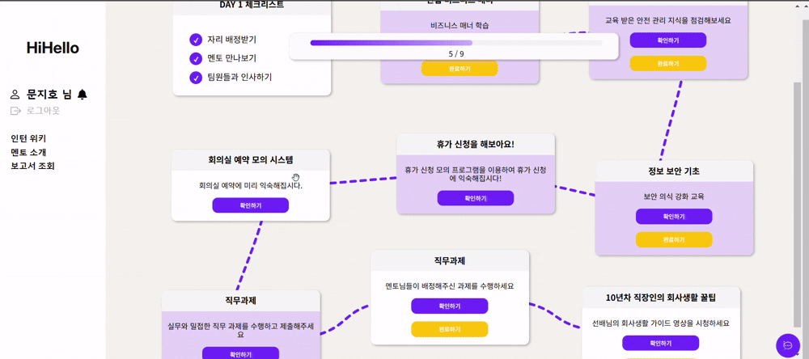

  멘티 휴가 예약 체험
  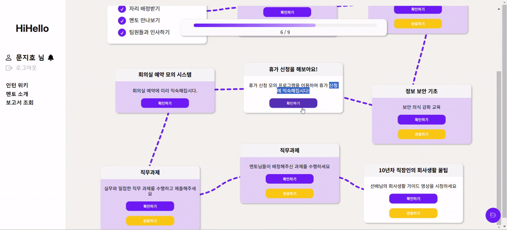
  

  

  
멘티 - 채팅

    
  그룹 채팅
    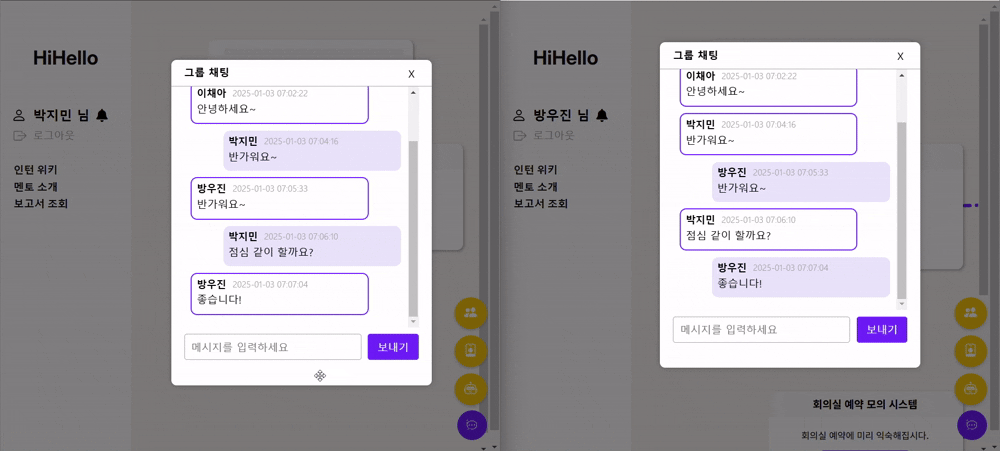
  

  

  
공통 - 챗봇

    
  챗봇
    
  

  

  
공통 - 프로필 조회

    
  프로필 조회
    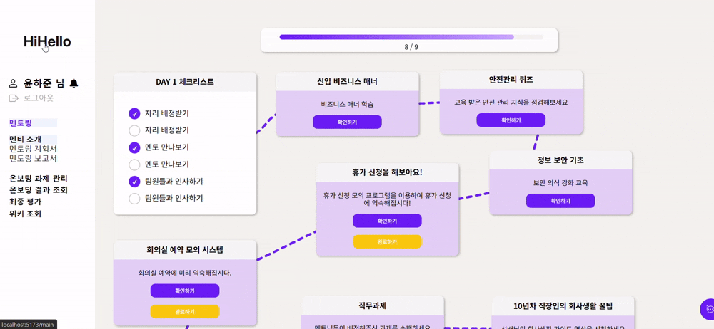
  

  

  
공통 - 위키

    
  위키 생성
  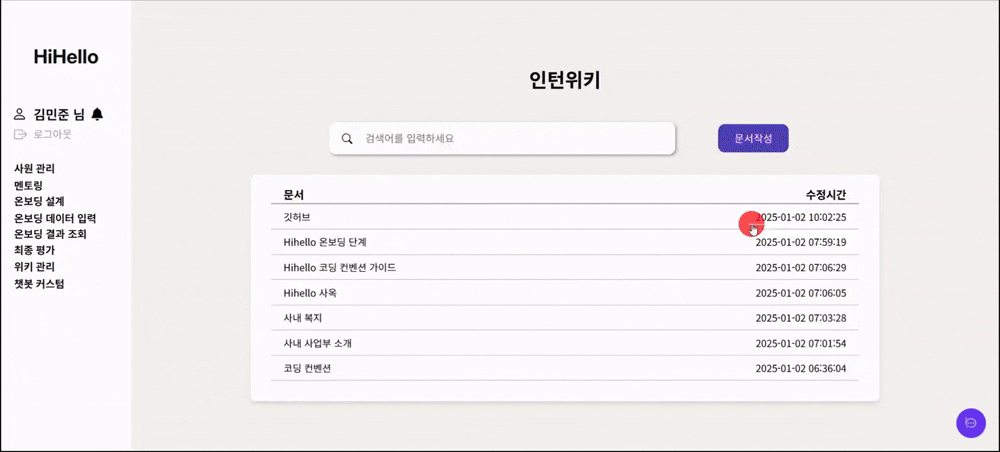
    
  위키 조회/수정 및 히스토리 조회
  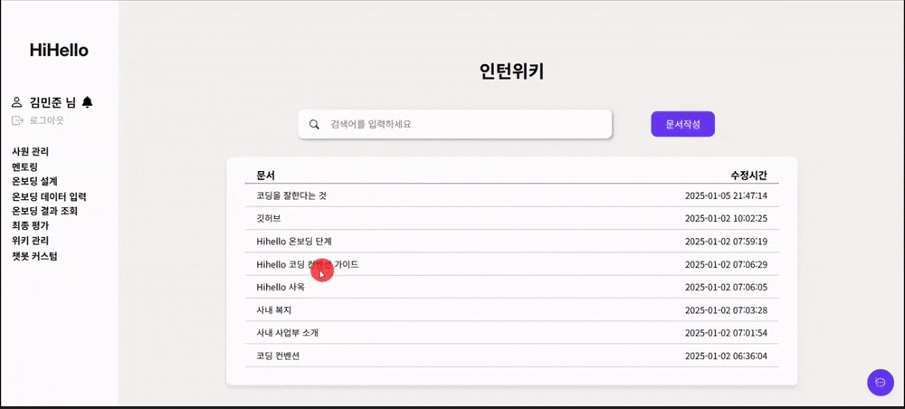
  

  
🎯 백엔드 단위 테스트

  

   

>[백엔드 단위 테스트](https://docs.google.com/spreadsheets/d/1F-cg6s2nEanYSHGntDhI2j4zHp84mA0LCy3uGkZ1FhE/edit?gid=1596520928#gid=1596520928)

  

  
🚀 CI/CD 계획서

  

    1. 지속적 통합 (CI)
    - 브랜치 관리:
      개발용 `develop` 브랜치와 배포용 `master` 브랜치를 명확히  구분하여 안정적인 코드 관리를 구현합니다.
    - Workflow 구성:  
      각 브랜치에 대해 별도의 워크플로우 파일 (`develop.yml`, `deploy.yml`)을 작성하여, 브랜치별 CI 작업을 독립적으로 처리합니다.
      
    2. 무중단 배포 (CD)
    - 무중단 배포 환경 구축: 
      AWS Elastic Beanstalk의 오토스케일링, 헬스체크 등 고급 기능을 활용하여 무중단 배포 환경을 설계합니다.
    - 배포 자동화:  
      코드 푸시와 동시에 배포 파이프라인이 작동하도록 설정하여 운영 효율성을 극대화합니다.
  

<h3>🎯 통합 배포 결과서</h3>

<h4>🏹 프론트엔드 배포</h4>

<h4>🏹 백엔드 배포</h4>
